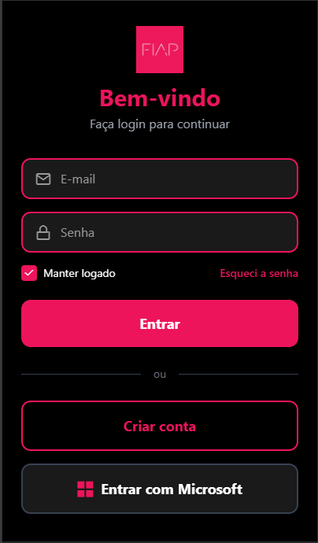

# FIAP Mobile - Tela de Login

## Descrição do Projeto

Aplicativo mobile desenvolvido em React Native com Expo, simulando a tela de login do app da FIAP. O projeto apresenta uma interface de autenticação não-funcional com design moderno em tema escuro, seguindo a identidade visual da FIAP.

## Ideia Principal

Criar uma tela de login intuitiva e visualmente fiel à identidade da FIAP, contendo os elementos essenciais de uma tela de autenticação: campos de e-mail e senha, opções de recuperação de senha, login persistente, criação de conta e login via Microsoft.

## Funcionalidades da Tela

- Logo FIAP centralizada
- Campo de e-mail com ícone
- Campo de senha com ícone e texto oculto
- Checkbox "Manter logado"
- Link "Esqueci a senha"
- Botão "Entrar"
- Botão "Criar conta"
- Botão "Entrar com Microsoft"

## Screenshot

  

## Membros do Grupo

| Nome | RM |
|---|---|
| Leonardo de Farias | 555211 |
| Gustavo Laur | 556603 |
| Giancarlo Cestarolli | 555248 |
